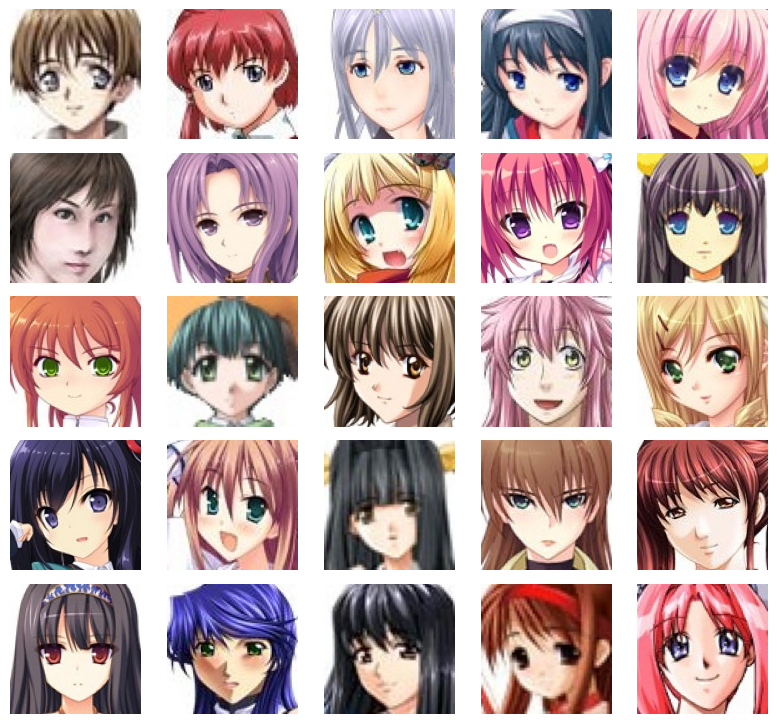

# Anime Face Generation - DCGAN
Wellcome to my project, an implementation the DCGAN (Deep Convolutional Generative Adversarial Networkd) model in Pytorch, designed to generate anime faces. The goal of this project is to generate realistic anime faces by training the model on a dataset collected from [Hugging Face](https://huggingface.co/). 

# Dataset
The [dataset](https://huggingface.co/datasets/DrishtiSharma/Anime-Face-Dataset) used for training the model is a collection over 63,000 anime face images. Since the dataset contains images of varying sizes, preprocessing is required before training to ensure the model learns the distinct features of anime faces. Some preprocessing steps include resizing images to 64x64, applying a center-crop to focus on the face, and normalization. 
## A Sample of the dataset

# Training
In a GAN, both the Generator and Discriminator are trained simultaneously. The Generator aims to produce fake samples, while the Discriminator tries to distinguish between real and fake ones. The Binary Cross Entropy (BCE) loss function is used to train both models. First, the Discriminator’s loss is calculated based on how accurately it identifies real images. Then, the loss is calculated based on its performance in recognizing fake samples generated by the Generator. By minimizing these losses, the Discriminator becomes better at distinguishing real from fake images. This improvement in the Discriminator forces the Generator to produce more realistic samples, learning from the feedback it receives.

For training, a straightforward DCGAN method is employed. Instead of loading the entire dataset into memory, images are loaded in batches when sampled. The training process can be summarized as follows:
* Sample real images from the dataset.
* Generate fake images using the Generator (with Gaussian noise as input).
* Train the Discriminator first on real images, then on fake images.
* Train the DCGAN by updating the Generator using real data labels (label = 1) for the fake images.
The training runs for 300 epochs - equivalent to 149,100 steps. On my setup, each epoch takes ~62 seconds.

## Loss plot:

## Full training process for a sample of 64 images as a GIF (image samples every epoch)

# Result 
## Faces generated at the end of 300 epochs:
### Sample 1
 

### Sample 2
 

The faces look pretty good to me. With more training, additional data, and likely an improved network, they could resemble real faces even more.

